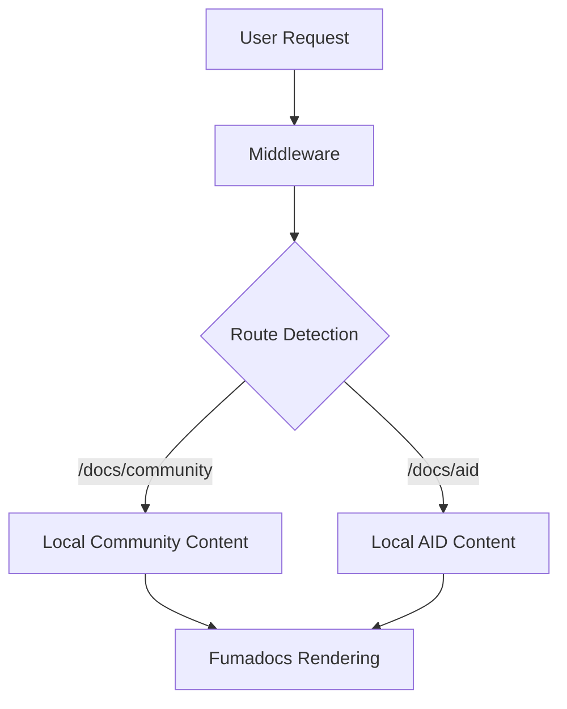
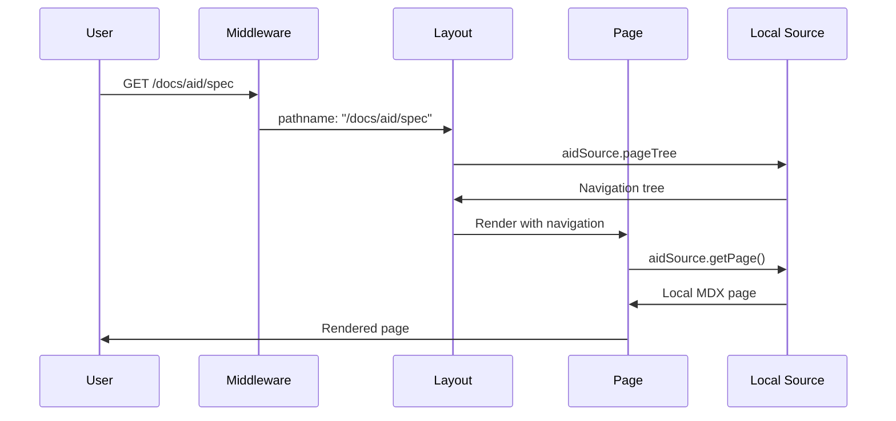
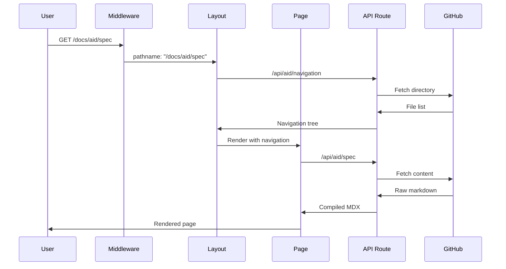

# Architecture: Local-Only Dual Sources with Fumadocs

## 📐 **System Overview**

This documentation site uses a **local-only dual-source** architecture. All content is stored in this repository and rendered via Fumadocs. Tabs switch between two local sources to isolate navigation trees.



---

## 📁 **File Structure & Responsibilities**

### **🔧 Core Configuration Files**

#### `source.config.ts`
**Purpose:** Defines content sources and MDX compilation settings
```typescript
export const docs = defineDocs({ dir: 'content/docs' });
export const aid = defineDocs({ dir: 'content/docs/aid' });
```
**Key Responsibilities:**
- ✅ Define content directories
- ✅ Set frontmatter schemas
- ✅ Configure MDX compilation options

#### `lib/source.ts`
**Purpose:** Creates fumadocs loaders for content sources
```typescript
export const source = loader({ source: docs.toFumadocsSource() });
export const aidSource = loader({ source: aid.toFumadocsSource() });
```
**Key Responsibilities:**
- ✅ Initialize fumadocs loaders
- ✅ Configure base URLs for routing
- ✅ Export sources for layout/page components

---

### **🚦 Request Flow Control**

#### `middleware.ts`
**Purpose:** Route detection and header injection (used to select the correct source tree)
```typescript
export function middleware(request: NextRequest) {
  requestHeaders.set('x-pathname', request.nextUrl.pathname);
  return NextResponse.next({ request: { headers: requestHeaders } });
}
```
**Key Responsibilities:**
- ✅ Detect current route path
- ✅ Inject pathname into headers
- ✅ Enable server components to access route info

**Flow:**
```
Request → Middleware → Headers Enhanced → Layout/Page Components
```

---

### **🎨 Layout & Navigation**

#### `app/docs/layout.tsx`
**Purpose:** Sidebar generation and tab switching between local sources
```typescript
export default async function Layout({ children }) {
  const pathname = await headers().get('x-pathname');
  const isAIDRoute = pathname.startsWith('/docs/aid');
  
  const currentTree = isAIDRoute ? aidSource.pageTree : source.pageTree;
}
```
**Key Responsibilities:**
- ✅ Read route from middleware headers
- ✅ Switch navigation trees based on route + environment
- ✅ Configure sidebar tabs
- ✅ Manage footer links

**Decision Logic:**
```
Route Detection → Environment Check → Content Source Selection → Sidebar Rendering
```

---

### **📄 Page Rendering**

#### `app/docs/[[...slug]]/page.tsx`
**Purpose:** Local content rendering with proper source selection
```typescript
export default async function Page({ params }) {
  const isAIDRoute = pathname.startsWith('/docs/aid');
  
  if (isAIDRoute) return renderLocalContent(aidSource.getPage(slug.slice(1)));
  return renderLocalContent(source.getPage(slug));
}
```
**Key Responsibilities:**
- ✅ Route and environment detection
- ✅ Content source selection (local vs remote)
- ✅ MDX compilation and rendering
- ✅ Static parameter generation for build optimization

**Rendering Path:**
```
Community Content: source.getPage() → Local MDX → Standard Rendering
AID Content:       aidSource.getPage() → Local MDX → Standard Rendering
```

---

### **🌐 API Routes**

#### `app/api/mdx/aid/[...slug]/route.ts`
**Purpose:** Serve local AID content as plain text (copy/export features)
```typescript
export async function GET(request, { params }) {
  const page = aidSource.getPage(params.slug);
  return new NextResponse(await getLLMText(page));
}
```
**Key Responsibilities:**
- ✅ Access local AID content
- ✅ Convert to plain text format
- ✅ Support copy/export functionality

---

### **📝 Content Structure**

#### `content/docs/` (Community Content - Always Local)
```
content/docs/
├── meta.json           # Community navigation
├── index.mdx           # Community home page
├── work-items/
│   └── index.mdx       # Work items documentation
└── test.mdx            # Test content
```
**Purpose:** Local community documentation
**Characteristics:**
- ✅ Always served locally for fast access
- ✅ Controlled by the docs team
- ✅ Standard fumadocs structure

#### `content/aid/` (AID Content - Local in Dev, Remote in Prod)
```
content/aid/
├── meta.json           # AID navigation structure
├── index.md            # Main AID page
├── specification.md    # Technical specification
├── quickstart.md       # Getting started guide
└── quickstart/
    ├── meta.json       # Subfolder navigation
    └── quickstart_mcp.md # MCP integration guide
```
**Purpose:** AID specification content
**Characteristics:**
- ✅ **Development:** Served locally for fast iteration
- ✅ **Production:** Fetched from remote GitHub repo
- ✅ Mirrors remote repository structure

#### `content/blog/` (Blog Content - Always Local)
```
content/blog/
├── meta.json           # Blog navigation
├── index.mdx           # Blog home
└── *.mdx               # Blog posts
```
**Purpose:** Blog posts and announcements
**Characteristics:**
- ✅ Local content only
- ✅ Standard fumadocs blog structure

---

### **🛠️ Supporting Infrastructure**

#### Remote integrations
- Removed. Local-only architecture.

#### `lib/get-llm-text.ts`
**Purpose:** Convert fumadocs pages to plain text for AI/copy features
**Key Responsibilities:**
- ✅ Extract content from fumadocs page objects
- ✅ Remove formatting for plain text output
- ✅ Support copy-to-clipboard functionality

#### `components/ai/page-actions.tsx`
**Purpose:** Page action buttons (copy, view source, etc.)
**Key Responsibilities:**
- ✅ Copy page content to clipboard
- ✅ Link to source files (local or GitHub)
- ✅ Provide markdown download options

---

## 🔄 **Data Flow Diagrams**

### **Development Mode Flow**


### **Production Mode Flow**


---

## 🏗️ **Component Architecture**

### **Layout Component Hierarchy**
```
DocsLayout (fumadocs-ui)
├── Sidebar
│   ├── Tabs (Community | AID)
│   ├── Navigation Tree (source-dependent)
│   └── Footer Links
└── Main Content
    └── Page Component
```

### **Page Component Structure**
```
DocsPage (fumadocs-ui)
├── DocsTitle
├── DocsDescription  
├── DocsBody
│   ├── Page Actions (Copy/View)
│   └── MDX Content
└── TableOfContents
```

---

## 🔧 **Environment Configuration**

### **Development Environment**
```typescript
NODE_ENV=development
```
**Characteristics:**
- ✅ All content served locally
- ✅ Fast iteration and hot reload
- ✅ No external API dependencies
- ✅ Standard fumadocs patterns

### **Production Environment**
```typescript
NODE_ENV=production
NEXT_PUBLIC_APP_URL=https://agentcommunity.org
```
**Characteristics:**
- ✅ Community content: Local
- ✅ AID content: Local
- ✅ Path-first canonical with subdomain redirects

---

## 🧩 **Integration Points**

### **Fumadocs Integration**
- ✅ **Loaders:** Standard `loader()` pattern for local content
- ✅ **Components:** Uses `DocsLayout`, `DocsPage`, etc.
- ✅ **MDX:** Standard fumadocs MDX compilation
- ✅ **Navigation:** Compatible with fumadocs tree structure

### **GitHub Integration**
- ✅ **API:** GitHub Contents API for file discovery
- ✅ **Authentication:** Optional GitHub token for rate limits
- ✅ **Caching:** Configurable cache headers by environment
- ✅ **Error Handling:** Graceful degradation on API failures

### **Next.js Integration**
- ✅ **Middleware:** Standard Next.js middleware for route detection
- ✅ **API Routes:** Next.js API routes for remote content
- ✅ **Static Generation:** Supports both static and dynamic content
- ✅ **Server Components:** Leverages React Server Components

---

## 🚦 **Error Handling & Resilience**

### **Local Content Errors**
- Missing files → 404 pages
- Invalid frontmatter → Build-time errors
- Malformed JSON → Development server errors

### **Remote Content Errors**
- GitHub API down → Fallback error messages
- Rate limits exceeded → Cached content or error pages
- Network timeouts → Graceful degradation
- Invalid remote content → Error boundaries

### **Development vs Production**
- **Development:** Immediate error feedback for fast debugging
- **Production:** Graceful error handling with user-friendly messages

---

## 📊 **Performance Characteristics**

### **Development Performance**
- ✅ **Local content:** Instant page loads
- ✅ **Hot reload:** Fast iteration cycles
- ✅ **No API calls:** No network dependencies

### **Production Performance**
- ✅ Static generation for community and AID
- ✅ Unified search endpoint

---

## 🚨 **Current Implementation Status**

### **✅ Final Approach (WORKING)**
- Separate local sources `content/docs/` and `content/docs/aid/`
- Each tab displays isolated content

### **🔧 Key Learning**
**Fumadocs tab filtering requires separate content sources.** The framework cannot filter a single unified tree by URL prefix patterns. Each tab needs its own dedicated source/loader for proper content isolation.

### **📋 Tomorrow's Action Plan**
1. Use dual local sources (`content/docs/` + `content/docs/aid/`)
2. Icons via `meta.json` (Lucide names)
3. Unified search endpoint
4. Blog subdomain via rewrites

**Architecture Status: Requires dual sources for proper fumadocs tab functionality.** ⚠️ 