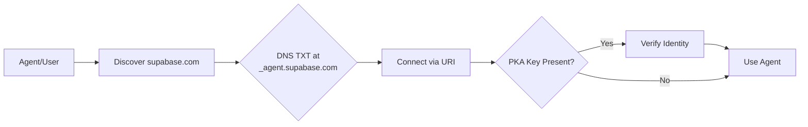

[View raw markdown](https://github.com/agentcommunity/agent-interface-discovery/raw/main/packages/docs/specification.md)

# Agent Identity & Discovery (AID)

> ## DNS for Agents. **Identity for the Agentic Web.**

> Type a domain. Connect to its agent. Instantly.

Think of AID as the public address book for the agentic web.

It's a simple, open standard that uses the internet's own directory—DNS—to answer one question: **"Given a domain, where is its AI agent, and how do I know it's the real one?"**

No more hunting through API docs. No more manual configuration. It's the zero-friction layer for a world of interconnected agents.

[**:rocket: Try it Now — Live Resolver & Generator**](https://aid.agentcommunity.org/workbench){ .md-button .md-button--secondary target="\_blank" }

---

## Why It Matters

AID creates a seamless experience for everyone in the ecosystem.

user "For Users: It Just Works - no setup wizard, no MCP copy-pasting."

> You want to connect your Notion to a new AI assistant. You type `notion.so`. The connection happens automatically. Your experience is instant.

agent "For Agents: Autonomous Discovery - the foundation for true agent-to-agent interoperability"

> As an autonomous agent, you're tasked with analyzing a dataset stored in a Supabase project. You don't need to be pre-configured. You can programmatically discover the `supabase.com` agent endpoint, negotiate a connection, and complete your task.

---

## How It Works: The 30-Second Explainer

The entire mechanism is a single DNS lookup. It's simple, decentralized, and built on infrastructure that has powered the internet for decades.

1.  **Publish:** A provider (e.g., `supabase.com`) adds one `TXT` record to their DNS at a standard location: `_agent.supabase.com`.
2.  **Discover:** A client, given `supabase.com`, makes a single DNS query for the `TXT` record at that address.
3.  **Connect:** The record contains the agent's `uri`. The client uses it to connect directly.
4.  **Verify:** If a public key (`pka`) is present, the client performs a quick cryptographic handshake to prove the server's identity, ensuring a secure connection. (Optional)

[Try this flow now](https://aid.agentcommunity.org/workbench)

## Learn more

### Want the deep dive?

- [**Specification**](/aid/specification) – _The exact format, algorithms, and security rules._
- [**Identity & PKA**](/aid/Reference/identity_pka) – _How AID provides cryptographic proof of an agent's identity._
- [**Rationale**](/aid/rationale) – _The design philosophy behind AID._
- [**Security Best Practices**](/aid/security) – _DNSSEC, redirect handling, local execution, IDN safety, TTL & caching._
- [**aid-doctor CLI**](/aid/Tooling/aid_doctor) – _Validate, secure, and generate AID records._
- [**What’s New**](/aid/Reference/whats_new) – _Recent documentation updates._

---

## SDKs and Tools

AID has official libraries and tools across multiple languages, with additional ports in progress.

- TypeScript/Node & Browser: `@agentcommunity/aid`
- TypeScript Core Library: `@agentcommunity/aid-engine` – Pure business logic for discovery, validation, and PKA
- CLI Tool: `@agentcommunity/aid-doctor` – Validate, secure, and generate AID records (wraps aid-engine)
- Python: `aid-discovery` (transfer to community planned)
- Go: `aid-go`
- Rust: `aid-rs`
- .NET: `aid-dotnet`
- Java: `aid-java`
- Web Workbench: Interactive generator/resolver

See the full package overview in the [Quick Start](/aid/quickstart) and the cross-language [Discovery API](/aid/Reference/discovery_api).

!!! tip "Implementation Files"
All SDKs share constants generated from a single source: [`protocol/constants.yml`](https://github.com/agentcommunity/agent-interface-discovery/blob/main/protocol/constants.yml).
View generated files: [TypeScript](https://github.com/agentcommunity/agent-interface-discovery/blob/main/packages/aid/src/constants.ts), [Python](https://github.com/agentcommunity/agent-interface-discovery/blob/main/packages/aid-py/aid_py/constants.py), [Go](https://github.com/agentcommunity/agent-interface-discovery/blob/main/packages/aid-go/constants_gen.go), [Rust](https://github.com/agentcommunity/agent-interface-discovery/blob/main/packages/aid-rs/src/constants_gen.rs), [.NET](https://github.com/agentcommunity/agent-interface-discovery/blob/main/packages/aid-dotnet/src/Constants.g.cs), [Java](https://github.com/agentcommunity/agent-interface-discovery/blob/main/packages/aid-java/src/main/java/org/agentcommunity/aid/Constants.java)

---

## Use Cases

- Simple connections: Type a domain, connect automatically. No manual setup.
- Stronger trust (optional): Add identity proof to ensure you’re talking to the right service. See [Identity & PKA](/aid/Reference/identity_pka).
- Local and dev workflows: Safely run local agents with explicit consent; discover dev agents on your network.
- Multi-protocol ecosystems: Connect across MCP, A2A, OpenAPI, gRPC, GraphQL, or WebSocket.
- Smooth migrations: Deprecate old endpoints gracefully with clear timelines.
