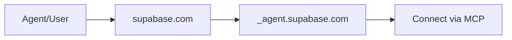

[View raw markdown](https://github.com/agentcommunity/agent-interface-discovery/raw/main/packages/docs/specification.md)

# Agent Interface Discovery (AID)

> ## DNS for Agents.
>
> Type a domain. Connect to its agent. Instantly.

Think of AID as the public address book for the agentic web.

It's a simple, open standard that uses the internet's own directory—DNS—to answer one question: **“Given a domain, where is its AI agent?”**

No more hunting through API docs. No more manual configuration. It's the zero-friction layer for a world of interconnected agents.

[**:rocket: Try it Now — Live Resolver & Generator**](https://aid.agentcommunity.org/workbench){ .md-button .md-button--secondary target="\_blank" }

---

## Why It Matters

AID creates a seamless experience for everyone in the ecosystem.

!!! user "For Users: It Just Works - no setup wizard, no MCP copy-pasting."

    You want to connect your Notion to a new AI assistant. You type `notion.so`. The connection happens automatically. Your experience is instant.

!!! agent "For Agents: Autonomous Discovery - the foundation for true agent-to-agent interoperability"

    As an autonomous agent, you're tasked with analyzing a dataset stored in a Supabase project. You don't need to be pre-configured. You can programmatically discover the `supabase.com` agent endpoint, negotiate a connection, and complete your task.

---

## How It Works: The 30-Second Explainer

The entire mechanism is a single DNS lookup. It's simple, decentralized, and built on infrastructure that has powered the internet for decades.

1.  **Publish:** A provider (e.g., `supabase.com`) adds one `TXT` record to their DNS at a standard location: `_agent.supabase.com`.
2.  **Discover:** A client, given `supabase.com`, makes a single DNS query for the `TXT` record at that address.
3.  **Connect:** The record contains the agent's `uri`. The client uses it to connect directly.

[Try this flow now](aid.agentcommunity.org/workbench)

### Want the deep dive?

- [**Rationale**](rationale.md) – _Why we chose DNS, why the manifest was removed, and why simplicity wins._
- [**Specification**](specification.md) – _The exact `TXT` record format, client algorithm, and security rules._
- [**Security Best Practices**](security.md) – _DNSSEC, redirect handling, local execution, IDN safety, TTL & caching._
