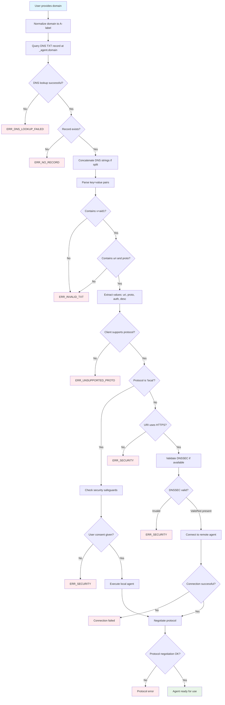

## **Agent Interface Discovery (AID) v1.0.0: Rationale and Trade-offs**

**Date:** 5 July 2025
**Document Status:** Companion to the AID v1.0.0 Specification

### **1. Introduction**

This document provides the rationale behind the design decisions in the Agent Interface Discovery (AID) v1.0.0 specification. A technical specification defines _what_ a standard is; this document explains _why_ it is that way. It outlines the core philosophy, highlights the protocol's strengths, defines its intentional limitations, and discusses the alternatives that were considered and rejected. Understanding these trade-offs is crucial for implementers, critics, and future contributors to the standard.

### **2. Core Philosophy: Pragmatism, Simplicity, and Decentralization**

The design of AID v1 is guided by a single, overarching principle: **Pragmatism over Purity**. Our goal is to create a standard that is immediately useful and adoptable by the widest possible audience. This led to three core tenets:

1.  **Embrace Existing Infrastructure:** The protocol leverages DNS TXT records, a technology that is universally supported, well-understood, and configurable by every domain owner on the planet. It avoids dependencies on newer, less-adopted standards or centralized services.
2.  **Minimize Complexity:** The v1 specification is intentionally lean. It solves one problem and one problem only: _discovering the primary entry point for an agent service_. By resisting the temptation to solve adjacent problems (like capability negotiation or rich configuration), AID v1 remains incredibly simple to implement for both providers and clients.
3.  **Default to Decentralization:** The protocol is inherently decentralized. There is no central registry, no required registration, and no single point of failure. If you own a domain, you can publish an AID record. This aligns with the foundational principles of the open internet.

### **3. What AID v1 Does Well (The Strengths)**

The minimalist design of AID v1 delivers several key advantages:

- **Ubiquitous and Immediate Deployability:** By using DNS TXT records, any service provider can implement AID today without waiting for new infrastructure to be deployed. Client libraries can be built with standard DNS resolvers available in every major programming language.
- **Unambiguous and Namespace-Safe Discovery:** The `_agent.<domain>` subdomain follows established conventions for service discovery ([RFC8552]), preventing collisions and keeping the root domain clean. The non-normative guidance for protocol-specific subdomains (e.g., `_agent._mcp.<domain>`) further demonstrates this flexibility.
- **Human-Readable and Easily Debuggable:** The `key=value` format is simple to read and write. A developer can debug any AID record with a single command (`dig TXT _agent.example.com`) without needing special tools, which dramatically lowers the barrier to entry. The optional `p` alias for `proto` is a minor but thoughtful concession to brevity in this human-readable context.
- **Superior User Experience via the `desc` Key:** The optional `desc` key is a small but critical feature. It allows a client to provide human-readable context _before_ a connection is made (e.g., "Connect to 'Google's AI Tools'?"), which builds user trust and clarity.
- **Elegant Support for Local Execution:** The `proto=local` token and its associated `uri` schemes (`docker:`, `npx:`, etc.) provide a clever, manifest-free way to support local agents. This retains the essence of a powerful use case from earlier, more complex drafts of AID without the overhead of a JSON manifest. It keeps the protocol lean while enabling a crucial feature.
- **Clear Path to the Future:** The specification explicitly acknowledges DNS SRV records as the likely path for a future `v=aid2`. This signals foresight, addresses technical purism, and assures the community that AID is an evolving standard, not a myopic, short-term fix.

### **4. What AID v1 Intentionally Does NOT Do (Defining the Boundaries)**

A successful standard is defined as much by the problems it _doesn't_ solve as by the ones it does. AID v1 is intentionally scoped to be a discovery and bootstrapping layer only.

- **It is NOT a Capability Discovery Protocol.**
  - **What it does:** AID tells a client that an endpoint speaks a certain protocol (e.g., `proto=mcp`).
  - **What it does NOT do:** It does _not_ describe what that agent can do (e.g., what tools it has, what resources it offers). That is the explicit job of the target protocol's own handshake (e.g., an MCP `initialize` request or an A2A `AgentCard` fetch).
  - **Rationale:** This separation of concerns is critical. It keeps AID simple and allows the communication protocols (MCP, A2A) to evolve their rich capability models independently of the discovery mechanism. Combining them would create a bloated and brittle standard.

- **It is NOT a Service Health or Uptime Protocol.**
  - **What it does:** AID provides a static pointer to a service endpoint.
  - **What it does NOT do:** It does not guarantee that the service at the URI is online, healthy, or responsive.
  - **Rationale:** Service health is a real-time, stateful concern. DNS is a slow-moving, cached system. Conflating the two is an architectural anti-pattern. The client is responsible for attempting a connection and handling failures.

- **It is NOT an Identity or Authentication Protocol.**
  - **What it does:** AID provides an `auth` _hint_ (e.g., `auth=pat`) to guide the client's authentication flow.
  - **What it does NOT do:** It does not provide tokens, keys, or cryptographic proof of the agent's identity.
  - **Rationale:** Authentication is a transport- and application-layer concern. The `auth` hint simply tells the client which mechanism to use (e.g., "prepare for an OAuth flow" or "prompt the user for a PAT"). The actual security and identity verification happens during the connection over TLS and within the subsequent protocol handshake.

> Note — Interoperability
>
> Some early MCP servers – notably Supabase’s TypeScript build – still rely on a Personal Access Token (`SUPABASE_ACCESS_TOKEN`) instead of the OAuth metadata flow mandated by MCP. Clients can work around this by publishing `auth=pat` in their AID record and prompting the user for the PAT. This workaround is temporary and not part of the normative AID behaviour.

- **It is NOT a Rich Configuration Management System.**
  - **What it does:** AID provides a single URI.
  - **What it does NOT do:** It does not provide a complex set of environment variables, command-line arguments, or other configuration parameters.
  - **Rationale:** This is the most significant departure from earlier, more complex drafts. The `aid.json` manifest was powerful but also created a high barrier to entry. AID v1 posits that if an agent requires complex configuration, that should be handled by the agent's own onboarding flow, documentation, or CLI interface, not by the initial discovery protocol. Simplicity is paramount for a v1 standard.

### **5. Alternatives Considered and Rejected**

- **Full `aid.json` Manifest:** While powerful for describing complex local and remote implementations, the manifest-based approach was deemed too burdensome for a v1 standard. It required providers to host and maintain a JSON file, and clients to implement a significantly more complex resolution and validation logic. The new `proto=local` feature captures 80% of the manifest's value with 20% of the complexity.
- **DNS `SRV` or `HTTPS/SVCB` Records:** These are technically more "correct" for service discovery. However, they lack the universal, simple configuration support of `TXT` records in many DNS providers' dashboards. Furthermore, client-side resolver support is not yet ubiquitous. For v1, `TXT` offers the path of least resistance to adoption, with a clear migration path to `SRV`/`HTTPS` in the future.
- **Centralized Registry:** A central "Agent Store" or registry was rejected as it violates the principle of decentralization, creates a single point of failure, and introduces a gatekeeper to the ecosystem. DNS is the world's most successful decentralized registry, and AID leverages it directly.
- **Well-Known URI (`/.well-known/aid`):** This requires a client to make an HTTP request to discover the service, which is slower and less efficient than a single, lightweight DNS query. DNS is the right tool for finding the location of a service; HTTP is for interacting with it once found.

### **6. Conclusion**

AID v1 is a deliberately focused and pragmatic standard. It provides a simple, robust, and immediately deployable solution to the critical problem of agent discovery. By understanding what it does well and, just as importantly, what it _intentionally_ does not do, the community can build a powerful and interoperable ecosystem on a solid and stable foundation.

---

**Next Steps:**

- [Quick Start Guide](quickstart/index.md)
- [Blog: The Missing MX Record](blog/missing_record.md)

---

## Appendix: Full Protocol Flowchart

