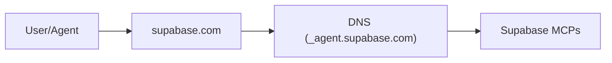
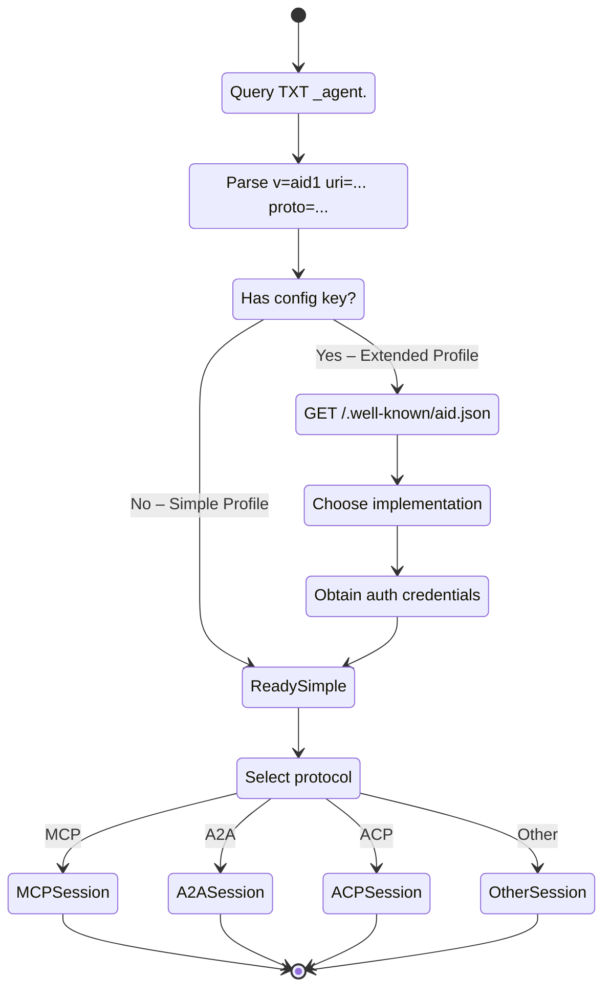

# Agent Interface Discovery (AID)

> ##DNS for Agents
> *Type a domain – connect to its agent(s), instantly.*

Imagine opening your favourite AI‑powered IDE, typing just `supabase.com`, and having the client wire itself to the official Supabase MCP server with zero extra steps. No digging through docs, no JSON snippets, no token wrangling. That "it just works" moment is what **AID** delivers.

!!! agent "Agent-first Discovery"
    Agent wants to use a tool. It just enters `supabase.com` and automatically resolves the MCP endpoints—no documentation required.

## What it does (in one sentence)

AID is a tiny DNS record that tells any client **where** an agent lives, **which** protocol it speaks (MCP, A2A, ACP, …), and **how** to start talking to it.

## Links

-   [:material-file-document-outline:{ .lg .middle } __Specification__ ](spec-v1.md)

    Read the full Specification

-   [:material-forum:{ .lg .middle } __Design Rationale__](rationale.md)

    Understand the design decisions for AID.

## Why you should care

* **Good‑bye manual setup** – Paste a domain, not a 200‑line config.
* **Fewer docs, fewer errors** – The record is the source of truth, always up to date.
* **Works with today's winners** – Designed around MCP while staying protocol‑agnostic.
* **Agents find tools, too** – Your agents can now locate and chain the services they need on the fly – true autonomy.
* **Zero lock‑in** – Uses plain DNS + HTTPS, so any provider can adopt it overnight.
* **Local/Diff domain tooling** - Enables complex protocol discovery via standardized mechanisms.

## How it works (30‑second version)

1. Client queries `TXT _agent.<domain>`.
2. If the record holds a full URI, connect right away.
3. If it points to an `aid.json` manifest, fetch it and pick the best implementation (remote API, local Docker, etc.).
4. Kick off the session using the declared protocol – typically MCP.

That is the whole boot‑strap layer. The heavy lifting (auth flows, task calls) stays in MCP or whichever protocol you choose.

---

### The full discovery flow

For those who like state charts, here's the exact handshake AID enables.

---

### Want the deep dive?

* [**Rationale**](rationale.md) – *Why discovery belongs in DNS and how AID complements `.well-known`.*
* [**Specification**](spec-v1.md) – *Exact TXT keys, manifest schema, security model.*

(See the neighbouring docs in this folder.)
